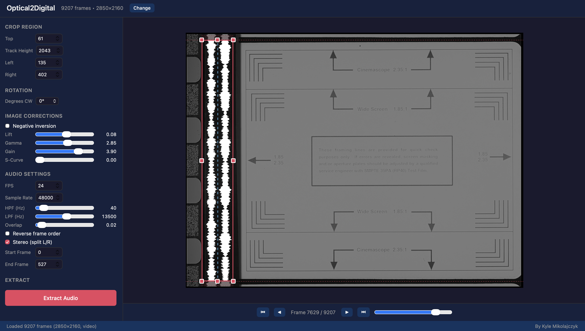

# Optical2Digital

<p align="center">
  
</p>

## Optical Audio to Digital PCM
Optical audio on film has been a critical part of the presentation of motion pictures since the 1920s when variable-area/variable-density was first introduced.
Converting scans of film can be difficult, and extracting audio moreso. There has been a very good tool for the past decade, [AEO-Light](https://github.com/usc-imi/aeo-light), that is popular 
to use to convert the audio. However, the codebase is in C++, and it is difficult to understand how it works, and to add new features to. As a result, this project is to create a modern 
Optical to Digital conversion tool, written in python, that can convert optical audio of all shapes and sizes (hopefully other formats too like Dolby-Digital or SDDS) and Dolby A/SR easily and effectivly. 
Also, another important goal is that anyone can understand how the audio conversions work and can extend the functionality into their own projects too.



Currenty archetecture is a React front-end and a python backend, but they can be run in many ways. The python/backend can be used via REST and can be programatically called. Developers or software-minded users can launch the application locally and run it in a browser.

### Stand-Alone App
There is work being done to have the python/react packaged as a OS-native application for devices that run the server and front end, and contain ffmpeg, all in one click. The hope is this version is useful for archivisits and others who want the application to "just work". Mac-OS, Windows (x64 and arm64), and Linux (Debian/Ubuntu `.deb`, amd64 and arm64) are currently generated, all distributed under Releases. See [Download the app](#download-the-app)

### Kyle's Optical Decoder
Python CLI tool that can extract film optical audio

### Prerequisites for developer environment
- Python 3.10+
- Node.js 18+
- ffmpeg (must be on your `PATH`) — required for the Export Video feature (muxing/rendering); install via `brew install ffmpeg` (macOS), your Linux package manager, or from [ffmpeg.org](https://ffmpeg.org/) (Windows). Not required for WAV-only extraction.

## Download the app

### macOS

Grab the latest `Optical2Digital.dmg` from the [Releases page](../../releases), open it, and drag `Optical2Digital.app` to Applications.

**First launch only:** because this build isn't code-signed, macOS will refuse a plain double-click with an "unidentified developer" warning. Instead, right-click (or Control-click) `Optical2Digital.app` and choose **Open**, then confirm in the dialog that appears. After that first launch, it opens normally.

No Python, Node, or ffmpeg install needed — everything required is bundled inside the app.

### Windows

Grab the latest `Optical2Digital-Setup-x64.exe` (or `-arm64.exe` on ARM-based Windows devices, e.g. Surface Pro X / Snapdragon laptops) from the [Releases page](../../releases) and run it — it installs to Program Files, adds a Start Menu shortcut, and registers an uninstaller. Prefer not to install anything? Grab `Optical2Digital-win-x64.zip` (or `-win-arm64.zip`) instead, extract it anywhere, and run `Optical2Digital.exe` directly from the extracted folder.

**First launch only:** because this build isn't code-signed, Windows SmartScreen will show an "unrecognized publisher" warning. Click **More info**, then **Run anyway** to proceed. After that first launch, it opens normally.

No Python, Node, or ffmpeg install needed — everything required is bundled inside the app.

### Linux (Debian / Ubuntu)

1. Download the latest `.deb` for your CPU from the [Releases page](../../releases):
   `Optical2Digital-linux-amd64.deb` for a normal PC/laptop, or
   `Optical2Digital-linux-arm64.deb` for an ARM machine (Raspberry Pi, Ampere, a VM on Apple Silicon).

2. Install it with `apt` (this pulls in the few system libraries the bundled UI needs):

   ```bash
   cd ~/Downloads
   sudo apt install ./Optical2Digital-linux-amd64.deb
   ```

   The leading `./` matters — it tells `apt` to install a local file rather than look for a package by that name. Use `apt`, **not** `sudo dpkg -i`: `dpkg` won't install the dependencies (if you already did, run `sudo apt-get install -f` to finish).

   If `apt` prints a `Download is performed unsandboxed as root ... Permission denied` notice, it's harmless — the install still completes. It just means the `.deb` sat in a directory the `_apt` user can't read; installing from `~/Downloads` or `/tmp` avoids it.

3. Launch it from your application menu (**Optical2Digital**) or by running `optical2digital` in a terminal.

No Python, Node, or ffmpeg install needed — everything required is bundled inside the app. It installs to `/opt/Optical2Digital`. Uninstall with:

```bash
sudo apt remove optical2digital
```

The `.deb` is built on Ubuntu 22.04, so it runs on Ubuntu 22.04 / 24.04 (and newer) plus current derivatives such as Mint, Pop!_OS, and Debian 12+.

### Developer Setup (normal local)

First time: `start-dev-fresh.sh` (macOS/Linux) or `start-dev-fresh.bat` (Windows)
Afterwards: `start-dev.sh` (macOS/Linux) or `start-dev.bat` (Windows)

### Setup (development)

**Backend (Python):**
```bash
python -m venv .venv
source .venv/bin/activate   # macOS/Linux
# .venv\Scripts\activate    # Windows

pip install wheel cmake scikit-build setuptools packaging numpy scipy natsort fastapi uvicorn pydantic pywebview pyinstaller
CMAKE_ARGS="-DBUILD_opencv_dnn=OFF" pip install --no-build-isolation opencv-python  # set $env:CMAKE_ARGS instead on Windows PowerShell
```
(opencv-python is installed last, with build isolation off, so it builds
against the numpy already installed above rather than fetching its own old
pinned numpy — which has no prebuilt wheel on some platforms, e.g. Windows
ARM64, and fails to compile from source there. CMAKE_ARGS drops the unused
dnn module, which otherwise fails to *link* on Windows ARM64 — this app
never calls cv2.dnn.*. Both are no-ops wherever a prebuilt opencv-python
wheel installs instead of building from source. See the release workflow's
"Create Python virtualenv" step for the full explanation.)

**Frontend (React):**
```bash
cd frontend
npm install
```

### Running

Start the backend server:
```bash
python server.py
```

Start the frontend dev server (in a separate terminal):
```bash
cd frontend
npm run dev
```

Then open http://localhost:5173 in your browser.

### CLI Usage

`KylesOpticalDecoder.py` can also be used standalone from the command line:
```bash
python KylesOpticalDecoder.py --help
```

## License
This project is licensed under the GNU General Public License v3.0.
See [LICENSE](LICENSE) for the full text.

## Useful Links
* Sound-on-film https://en.wikipedia.org/wiki/Sound-on-film
* Dolby Stereo https://en.wikipedia.org/wiki/Dolby_Stereo
* Dolby SR https://en.wikipedia.org/wiki/Dolby_SR
* Dolby Digital https://en.wikipedia.org/wiki/Dolby_Digital

### Contributors
* Kyle Mikolajczyk
* Will Dirkschka
* Ben Peters
* Thomas Piccicone (35mm Scan Examples)